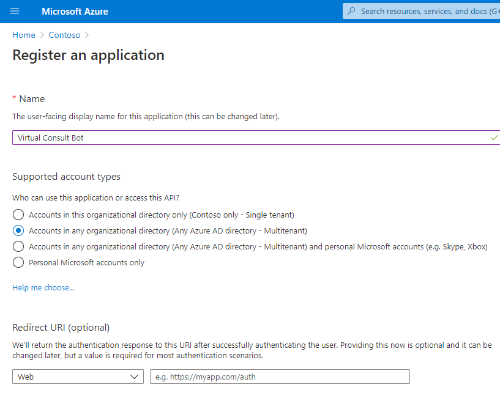
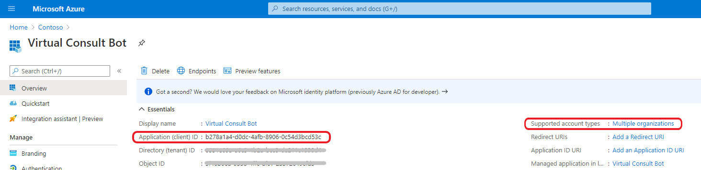
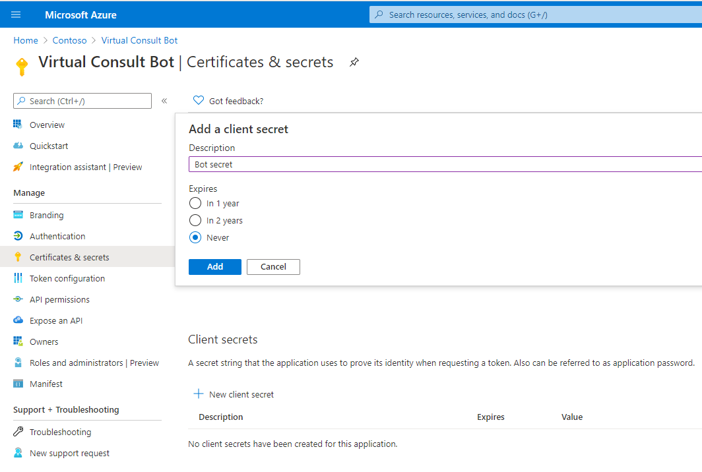
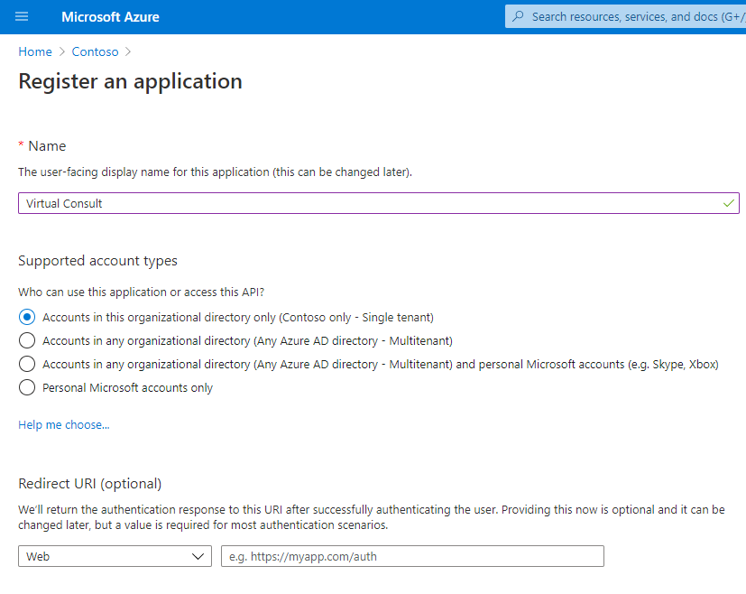
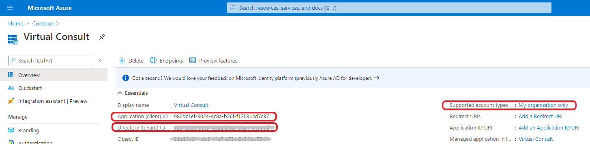
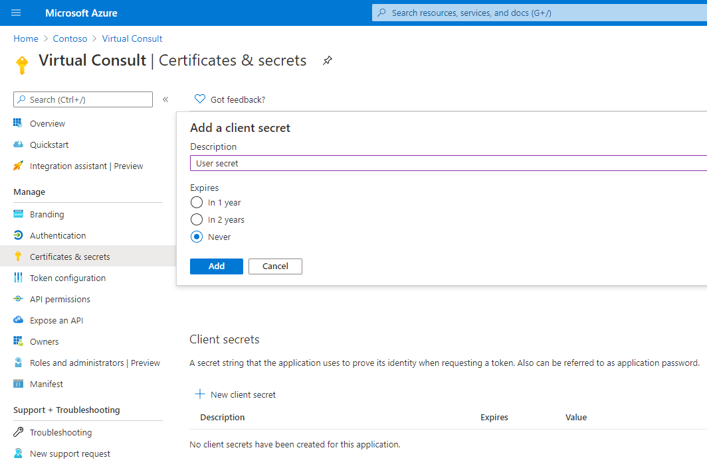
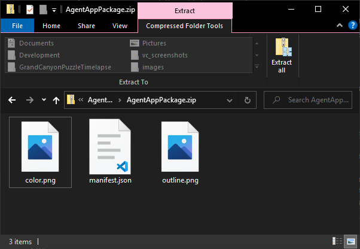

# Prerequisites
To begin, you will need: 
* An Azure subscription where you can create the following kinds of resources:  
    * App Service
    * App Service Plan
    * Bot Channels Registration
    * Azure Cosmos DB
    * Application Insights
* A tenant admin who can provide admin consent to required Graph permissions.
* A Microsoft Bookings admin who can create/modify Bookings resources.
* A team with the users who will be handling appointment requests. (You can add and remove team members later!)
* A copy of the [Appointment Manager app GitHub repo](https://github.com/OfficeDev/microsoft-teams-apps-appointment-manager)

# Overview
The Appointment Manager app for Microsoft Teams requires the following setup steps:

1. [Set up Microsoft Bookings](#setBookings)
1. [Register Azure Active Directory Applications](#regAz)
1. [Deploy to your Azure subscription](#deployAz)
1. [Set up authentication](#setAuth)
1. [Clone the application](#cloneApp)
1. [Create the Teams app packages](#teamsPackage)
1. [Install the apps in Microsoft Teams](#installTeams)
1. [Start the application in Microsoft Teams](#startTeams)

# <a name="setBookings"></a>Step 1: Set up Microsoft Bookings

Set up Microsoft Bookings in your tenant. If you already use Bookings and want to reuse your existing Bookings business, you may be able to skip some of these steps, but read the steps carefully to ensure that all fields are properly set.

## Enable Bookings in tenant

Depending on your tenant and licenses, Bookings may already be enabled, but it's best to verify in case an admin has previously disabled Bookings. This can be done manually through the M365 admin center or through PowerShell. For steps, see [Bookings docs on turning Bookings on/off](https://docs.microsoft.com/en-us/microsoft-365/bookings/turn-bookings-on-or-off?view=o365-worldwide).

## Create Bookings business

The first time you use Bookings, you must set up the Bookings business and calendar.

1. Go to the [Bookings onboarding page](https://outlook.office.com/bookings/onboarding).
2. Select **Get it now** and choose **Add a booking calendar**.
3. Enter your business name and type and select **Continue**.

For more details, see [Bookings docs on entering your business information](https://docs.microsoft.com/en-us/microsoft-365/bookings/enter-business-information?view=o365-worldwide).

## Create Bookings service

Next, set up a Bookings service that represents the service you are providing to your customers.

1. Go to the [Manage services](https://outlook.office.com/bookings/services) page and select **Add a service.**
2. Enter the details about your service, paying special attention to these fields:
    - **Add online meeting**: The app template will add online meetings to the Bookings appointments it creates, regardless of whether this is on or off.
    - **Default duration**: The app template uses a duration of **30 minutes** for appointments, regardless of the value set here.
    - **Reminders and confirmations**: Defines the emails sent to customers or staff members after an appointment is booked.
    - **Assign staff**: Don't select any specific staff members. This will allow all staff members to be assigned to appointment requests. 
3. Click **Save** at the top.

For more details, see [Bookings docs on defining your service offerings](https://docs.microsoft.com/en-us/microsoft-365/bookings/define-service-offerings?view=o365-worldwide).

## Create Bookings staff members

Next, create a Bookings staff member for each staff member who will be handling appointment requests.

1. Go to the [Manage staff](https://outlook.office.com/bookings/staff) page and select **Add staff**.
2. Click in the **Add people** box and start typing a staff member's name. The dropdown menu will show users from your organization. Select the desired user.
    > Note: The email address will automatically populate based on the user selected. This email address must match the user's user principal name (UPN).
3. Click the role dropdown and choose **Administrator**.
    > Note: In the app template, only Administrator staff members can assign appointment requests.
4. Click **Save** at the top.

For more details, see [Bookings docs on adding staff](https://docs.microsoft.com/en-us/microsoft-365/bookings/add-staff?view=o365-worldwide).

# <a name="regAz"></a>Step 2: Register Azure Active Directory Applications

Azure AD applications in the Microsoft identity platform can provide authentication and authorization services for applications and its users. For applications to perform identity and access management (IAM), they need to be registered with the Microsoft identity platform.

Two applications will be registered in Azure AD:
1. Application for bot
2. Application for user sign-in

## Application for bot

For the bot, register a **multi-tenant** Azure AD application with a client secret in your tenant. It must be a multi-tenant app because it will be used to register a service principal in the `botframework.com` tenant.

1. Log in to the Azure Portal for your subscription, open the Azure Active Directory panel, and go to the ["App registrations" blade](https://portal.azure.com/#blade/Microsoft_AAD_IAM/ActiveDirectoryMenuBlade/RegisteredApps).

1. Click on "New registration", and create an Azure AD application.
    - **Name**: The name of your Teams bot. If you are following the template for a default deployment, we recommend "Appointment Manager Bot".
        > Note: This name is not visible to users
    - **Supported account types**: Select "Accounts in any organizational directory (Any Azure AD directory - Multitenant)"
    - Leave the **Redirect URI** field blank.

    

1. Click on "Register". You'll be taken to the app's "Overview" page.

1. From the "Overview" page:
    - Copy the **Application (client) ID** and note it down as the "bot client ID".
    - Verify that **Supported account types** is set to "Multiple organizations".

    

1. On the side rail under the "Manage" section, navigate to the "Certificates & secrets" section. Under "Client secrets", click on "New client secret".
    - Add a **Description** for the secret.
    - Choose when the secret will **expire**.
    - Click "Add".

    

1. Once the client secret is created, copy its **Value** and note it down as the "bot client secret"; we will need it later.

At this point you have noted 2 unique values:
* Client ID for the bot
* Client secret for the bot

We recommend that you copy these values to a safe location that you can access later. We will need them later.

## Application for user sign-in

For authenticating users, register a **single-tenant** Azure AD application. It MUST be registered in the tenant where you will be using the Appointment Manager app.

1. Go back to the ["App registrations" blade](https://portal.azure.com/#blade/Microsoft_AAD_IAM/ActiveDirectoryMenuBlade/RegisteredApps).

1. Click on "New registration", and create an Azure AD application.
    - **Name**: The name of your Teams app. If you are following the template for a default deployment, we recommend "Appointment Manager".
    - **Supported account types**: Select "Accounts in this organizational directory only (Your Tenant only - Single tenant)"
    - Leave the **Redirect URI** field blank for now. We'll come back to it.

    

1. Click on "Register". You'll be taken to the app's "Overview" page.

1. From the "Overview" page:
    - Copy the **Application (client) ID** and note it down as the "user AAD client ID".
    - Copy the **Directory (tenant) ID** and note it down as the "tenant ID".
    - Verify that **Supported account types** is set to "My organization only".

    

1. On the side rail under the "Manage" section, navigate to the "Certificates & secrets" section. Under "Client secrets", click on "New client secret".
    - Add a **Description** for the secret.
    - Choose when the secret will **expire**.
    - Click "Add".

    

1. Once the client secret is created, copy its **Value** and note it down as the "user AAD client secret"; we will need it later.

In this step, you have noted 3 unique values:
* Tenant ID
* Client ID for the user AAD app
* Client secret for the user AAD app

We recommend that you copy these values to a safe location that you can access later. We will need them later.

# <a name="deployAz"></a>Step 3: Deploy to your Azure subscription
1. Click on the "Deploy to Azure" button below.

    [](https://portal.azure.com/#create/Microsoft.Template/uri/https%3A%2F%2Fraw.githubusercontent.com%2FOfficeDev%2Fmicrosoft-teams-apps-appointment-manager%2Fmain%2FDeployment%2Fazuredeploy.json)

1. When prompted, log in to your Azure subscription.

1. Azure will create a "Custom deployment" based on the ARM template and ask you to fill in the template parameters.

1. Under **Deployment scope**, select a subscription and resource group.
    * We recommend creating a new resource group.
    * The resource group location MUST be in a region that supports all of the following:
        * App Service
        * Bot Service
        * Cosmos DB
        * Application Insights
    
        For an up-to-date list of regions that support the services above, see this list of [products available by region](https://azure.microsoft.com/en-us/global-infrastructure/services/?products=app-service,bot-service,cosmos-db,monitor).

1. Fill in the rest of the parameters using the following table for guidance on certain parameters:

    > Note: Make sure that the values are copied as-is, with no extra spaces. The template checks that GUIDs are exactly 36 characters.

    > Note: Please ensure that you don't use underscore (_) or spaces in any of the field values otherwise the deployment may fail.

    | Parameter | Explanation |
    | --------- | ----------- |
    | Base resource name | Used to generate names for deployed Azure resources. The App Service name "[base resource name]" must be available. For example, if you select "apptmanager" as the base name, the name "apptmanager" must be available (not taken); otherwise, the deployment will fail with a Conflict error.<br><br>Remember the base resource name that you selected. We will need it later. |
    | Location | The Azure location where resources will be deployed. For example, "westus2". |
    | Bot client ID | The client ID of the AAD app registered for the bot (from above). |
    | Bot client secret | The client secret of the AAD app registered for the bot (from above). |
    | AAD client ID | The client ID of the AAD app registered for user sign-in (from above). |
    | AAD client secret | The client secret of the AAD app registered for user sign-in (from above). |
    | Default culture | The culture used for channel messages and in cases when the user's locale is unsupported or unknown. |
    | Supported cultures | The cultures supported by the app. The `defaultCulture` will be used for users with cultures outside this list. |
    | Tenant ID | The ID of the tenant where users will be using the Teams app (from above). If your Azure subscription is in a different tenant than your Teams app, make sure you change the Tenant ID to the tenant in which you are deploying this Teams app. |

1. Agree to the Azure terms and conditions by clicking on the check box "I agree to the terms and conditions stated above" located at the bottom of the page.

1. Click on "Purchase" to start the deployment.

1. Wait for the deployment to finish. You can check the progress of the deployment from the "Notifications" pane of the Azure Portal. It can take **up to an hour** for the deployment to finish.

    > Note: If the deployment fails, see the [deployment failure section](https://github.com/OfficeDev/microsoft-teams-apps-appointment-manager/wiki/Troubleshooting#1-code-deployment-failure) of the Troubleshooting guide.

1. Once the deployment has finished, go to the deployment's "Outputs" tab, and note down the values. We will need them later.
    * **botId:** This is the Microsoft Application ID for the Appointment Manager bot. For the following steps, it will be referred to as `%botId%`.
    * **appDomain:** This is the base domain for the Appointment Manager app. For the following steps, it will be referred to as `%appDomain%`.

> **IMPORTANT:** If you plan to use a custom domain name instead of relying on Azure Front Door, read [custom domain option doc](Custom-domain-option) before continuing any further.

# <a name="setAuth"></a>Step 4: Set up authentication

1. Ensure that you have the `%botId%` and `%appDomain%` values from the previous step.

    > If you have lost these, see the [botId/appDomain section](https://github.com/OfficeDev/microsoft-teams-apps-appointment-manager/wiki/Troubleshooting#2-forgetting-the-botId-or-appDomain) of the Troubleshooting guide.

1. Go back to the ["App registrations" blade](https://portal.azure.com/#blade/Microsoft_AAD_IAM/ActiveDirectoryMenuBlade/RegisteredApps).

1. In the application list, click on the app you previously created for user sign-in (not for the bot).

1. Under "Manage", click on "Authentication" and then "Add a platform".
    - Choose "Web"
    - For the redirect URI, enter `https://%appDomain%/auth`. For example, `https://appName.azurefd.net/auth`.
    - Click "Configure"

1. Under "Implicit grant", check "Access tokens" and "ID tokens".

1. Click "Save" to commit your changes.

1. Back under "Manage", click on "Expose an API".

1. Click on the "Set" link next to "Application ID URI", and change the value from "`api://%appId%`" to "`api://%appDomain%/%appId%`". For example, `api://appName.azurefd.net/00000000-0000-0000-0000-000000000000`.

1. Click "Save" to commit your changes.

1. Under "Scopes defined by this API", click on "Add a scope" and enter the following values:
    - **Scope name:** access_as_user
    - **Who can consent?:** Admins and users
    - **Admin/User consent display name:** Access the API as the current logged-in user
    - **Admin/User consent description:**  Access the API as the current logged-in user
    - **State:** Enabled

1. Click "Add scope" to commit your changes.

1. Under "Authorized client applications", click on "Add a client application" and enter the following values:
    * **Client ID**: `5e3ce6c0-2b1f-4285-8d4b-75ee78787346`
    * **Authorized scopes**: Select the `access_as_user` scope. (There should only be 1 scope in this list.)

1. Click "Add application" to commit your changes.

1. Repeat the previous two steps to add another authorized client with ID: `1fec8e78-bce4-4aaf-ab1b-5451cc387264`. After this step you should have **two** client applications (`5e3ce6c0-2b1f-4285-8d4b-75ee78787346` and `1fec8e78-bce4-4aaf-ab1b-5451cc387264`) listed under "Authorized client applications".

1. Back under "Manage", click on "API permissions".

1. Under "Configured permissions", click on "Add a permission" and select "Microsoft Graph", then "Delegated permissions".

1. From the list, select the following permissions:
    - `email`
    - `offline_access`
    - `openid`
    - `profile`
    - `BookingsAppointment.ReadWrite.All`
    - `Calendars.Read`
    - `Calendars.Read.Shared`
    - `User.ReadBasic.All`

    > Note: The first four permissions are under "OpenId permissions".

1. Click "Add permissions" to commit your changes.

1. Grant admin consent using one of the following three methods:
    1. If you are logged in as an Administrator, click on the "Grant admin consent for {tenant name}" button to grant admin consent.
    1. Inform your Admin to do the above option through the portal.
    1. Prepare an admin consent link and send it to your Admin: https://login.microsoftonline.com/common/adminconsent?client_id={appId}

    > Note: While none of the permissions above require admin consent, the Appointment Manager app template has not implemented user consent, so the only way to provide consent is through admin consent. See the [Known Limitations](known-limitations) doc for details.

# <a name="cloneApp"></a>Step 5: Clone the application
1. Clone the repository locally using the `git clone <REPO_URI>` command.

Note: To debug, run the application in development environment, refer to [Debug and Run Application Locally](debug-localrun)

# <a name="teamsPackage"></a>Step 6: Create the Teams app packages

Create two Teams app packages: one to be installed to teams for staff members and one for app admins to install personally. Before proceeding, ensure that you have cloned the app repository locally.

## Staff member app package

1. Open the `Manifest\AgentApp\manifest.json` file in a text editor.

1. Change the placeholder fields in the manifest to values appropriate for your organization.
    * `developer.name` ([What's this?](https://docs.microsoft.com/en-us/microsoftteams/platform/resources/schema/manifest-schema#developer))
    * `developer.websiteUrl`
    * `developer.privacyUrl`
    * `developer.termsOfUseUrl`

1. Replace all of the `<YOUR HOST DOMAIN>` placeholders with your `%appDomain%` value. This is for **configurableTabs**, **staticTabs** and **validDomains** to point to your web hosting location or tunneling service such as ngrok. If using tunneling service such as ngrok, use that full domain (ex: *subdomain*.ngrok.io)

1. Replace all of the `<YOUR BOT ID>` placeholders with your `%botId%` value.

1. Replace all of the `<AZURE AD APP ID FOR SSO>` placeholders with the Azure Active Directory(AAD) client ID of the user sign-in app.

1. Create a ZIP package with the `manifest.json`, `color.png`, and `outline.png`. The two image files are the icons for your app in Teams.
    * Name this package `appointment-manager-staff.zip`, so you know that this is the app for the staff.
    * Make sure that the 3 files are the _top level_ of the ZIP package, with no nested folders.  
    

## Admin app package

Repeat the steps above with the following differences:

- Modify the `Manifest\AdminApp\manifest.json` file.
- Some of the placeholders above may not exist in the admin app's `manifest.json`.
- Name the ZIP package `appointment-manager-admin.zip`, so you know that this is the app for admins.

# <a name="installTeams"></a>Step 7: Install the apps in Microsoft Teams

If your tenant has sideloading apps enabled, you can install your app by following the instructions for [loading your package into Teams](https://docs.microsoft.com/en-us/microsoftteams/platform/concepts/apps/apps-upload#load-your-package-into-teams).

You can also upload it to your tenant's app catalog, so that it can be available for everyone in your tenant to install. See [docs for managing your apps in the Teams admin center](https://docs.microsoft.com/en-us/microsoftteams/tenant-apps-catalog-teams).

1. Install the staff member app (the `appointment-manager-staff.zip` package) to your team of staff members.

1. Add the configurable tab to the team of staff members, so that they can view and manage appointment requests.

1. Install the admin app (the `appointment-manager-admin.zip` package) personally for an app admin.

Important note: You need to install the user/staff member application into Microsoft Teams before teams/channels will show up in the admin application for routing. This is because Resource-Specific Consent must occur for the admin app to query these secure resources.

# <a name="startTeams"></a>Step 8: Start the application in Microsoft Teams

## Create a service mapping

1. Open the admin app's "Configuration" tab as an app admin.

1. Click on "Add service" and enter the following values:

    - **Service name**: The name of the service. In the app template, this is a customer-facing string that identifies the category of the appointment request.
    - **To channel**: The Teams channel where appointment requests of this category should be sent.
    - **Bookings Business**: The Microsoft Bookings business under which these appointment requests should be booked.
    - **Bookings Service**: The Microsoft Bookings service under which these appointment requests should be booked.
    - **Supervisors** (optional): The list of supervisors for this category. Only these users will be able to perform supervisor operations, such as assigning appointment requests to other users. If no supervisors are specified, all users will be able to perform these operations.

1. Click on "Save service" to commit your changes

## Submit an appointment request

The API exposes an anonymous endpoint `/api/request` for submitting new appointment requests. In reality, your customer interface for submitting appointment requests would call this endpoint. For testing, you can use a tool like Postman to send a request to this endpoint on your deployed base domain.

An example request body is shown below. Be sure to change the following fields:
- `customerEmail`: Should be a real email address so that Microsoft Bookings can send an appointment email to the customer.
- `preferredTimes`: Should be set to future times.
- `category`: Should exactly match one of the service names configured by the app admin above.

```http
POST /api/request
Content-Type: application/json

{
    "customerName": "Megan Bowen",
    "customerPhone": "123-456-7890",
    "customerEmail": "<real email address>",
    "query": "I need help!",
    "preferredTimes": [
        {
            "startDateTime": "2020-11-09T15:00:00.000000Z",
            "endDateTime": "2020-11-09T19:00:00.000000Z"
        },
        {
            "startDateTime": "2020-11-09T23:00:00.000000Z",
            "endDateTime": "2020-11-10T02:00:00.000000Z"
        },
        {
            "startDateTime": "2020-11-10T15:00:00.000000Z",
            "endDateTime": "2020-11-10T17:00:00.000000Z"
        }
    ],
    "category": "<service name configured above>"
}
```

# Troubleshooting
Please see the [Troubleshooting](Troubleshooting) page.
