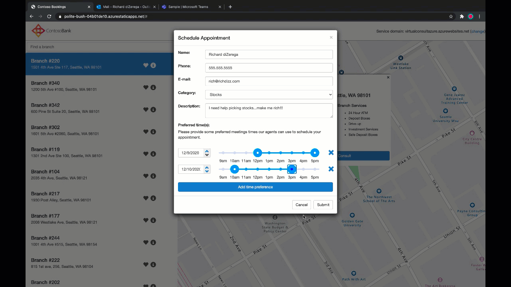

# Appointment Manager

Appointment Manager is a Teams app template to help businesses create, manage, and conduct virtual appointments with consumers through Teams. New appointment requests from consumers are visible in Teams channels, where they can quickly be assigned and reassigned to staff in a team. Appointment requests can be viewed at team or personal levels through custom tabs. Every appointment is associated with a Teams online meeting, so staff and consumers can easily join the meeting at the scheduled time.

The app template integrates with Microsoft Bookings for easy appointment management. Scheduled appointments automatically appear on assigned staff members' calendars, and consumers receive customizable email notifications and reminders with embedded meeting links.

Through a companion app, app admins can configure different appointment categories to be routed to different Teams channels. A supervisor of an appointment category has additional privileges, such as assigning appointments to other staff members in the team.

<!-- TODO: preview gif of app -->

* [Solution overview](solution-overview)
    * [Data stores](data-stores)
    * [Cost estimate](cost-estimate)
    * [Known limitations](known-limitations)
* Deploying the app
    * [Deployment guide](deployment-guide)
    * [Localization](localization)
    * [Troubleshooting](troubleshooting)
* [Extending Appointment Manager](taking-it-further) 

