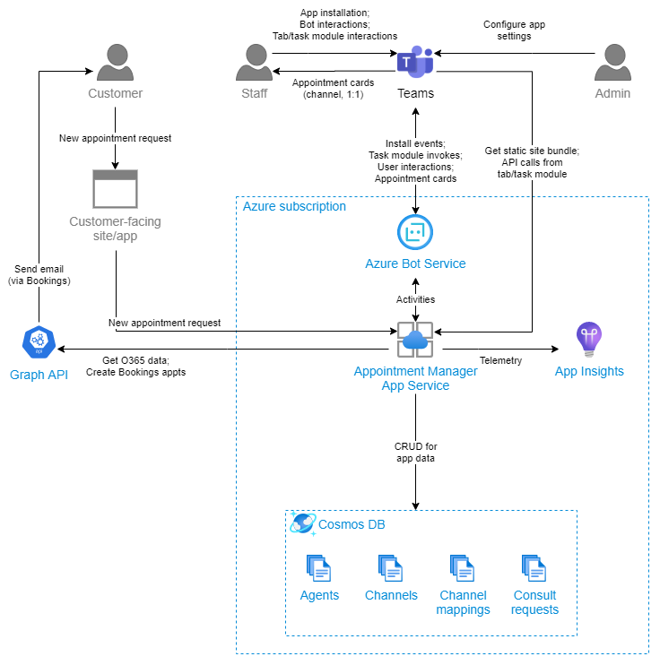

The Appointment Manager app template has the following main components:

- [**Azure App Service**](#azure-app-service): Hosts the API endpoints, including the bot messaging endpoint, and serves the static site for tabs and task modules.
- [**Azure Cosmos DB**](#azure-cosmos-db): Stores all application data, such as appointment requests and channel mappings. See [Data Stores](data-stores) for details.
- [**Azure Active Directory**](#azure-active-directory): Provides single sign-on for staff members in Teams. Also secures communication between the bot and Azure Bot Service.
- [**Application Insights**](#application-insights): Stores logs and telemetry data. See [Telemetry](telemetry) for details.
- [**Microsoft Graph API**](#microsoft-graph-api): Provides integration with O365 for determining staff member availability, getting profile pictures, and creating Bookings appointments.

## Azure App Service
Azure App Service hosts the .NET Core Web API that serves as the backend for the application. The API provides functionality needed by the app's frontend, such as appointment assignment and CRUD operations for channel mappings.

The API includes the bot messaging endpoint, which is registered with Azure Bot Service. It handles Bot Framework activities, such as updates to Teams channels and invoke activities for the messaging extension and task modules.

The API also serves static files, including the React app used for tabs and task modules.

## Azure Cosmos DB
Azure Cosmos DB with SQL API stores all application data in various containers. See [Data Stores](data-stores) for details on what data is stored.

## Azure Active Directory
Azure Active Directory (AAD) secures the API and provides single sign-on for staff members in Teams. Most of the API endpoints are protected by AAD by requiring a valid AAD token for access. The frontend components acquire an AAD token via Teams SSO and include the token in API requests.

AAD also secures communication between the bot messaging endpoint and Azure Bot Service. This service-to-service authentication is handled by the Bot Framework SDK.

## Application Insights
Application Insights is used for general logging and telemetry data for the app. See [Telemetry](telemetry) for details.

## Microsoft Graph API
The app uses the Graph API to access various services within O365. During appointment assignment, the task modules determine staff member availability using the Graph's calendar endpoints. Microsoft Bookings integration for creating Bookings appointments is also handled through Graph.

In most cases, the .NET backend calls Graph and passes results to the client through its own API. The backend acquires an access token for Graph by using the [OAuth 2.0 On-Behalf-Of flow](https://docs.microsoft.com/en-us/azure/active-directory/develop/v2-oauth2-on-behalf-of-flow) using the SSO token from Teams. For more details, see the [Teams Single Sign-On docs](https://docs.microsoft.com/en-us/microsoftteams/platform/tabs/how-to/authentication/auth-aad-sso).

In a few cases, the frontend components call Graph directly, such as retrieving the staff member's photos that are shown throughout the app.

The following table shows the Graph API endpoints used by the app:

| Use case | API | Permissions | API version |
| -------- | --- | --------------- | ----------- |
| Getting staff members in team | [List group members](https://docs.microsoft.com/en-us/graph/api/group-list-members?view=graph-rest-1.0&tabs=http) | `Member.Read.Group` (Teams resource-specific consent) | `v1.0` |
| Checking staff member availability in specific time slot | [List calendarView](https://docs.microsoft.com/en-us/graph/api/user-list-calendarview?view=graph-rest-1.0&tabs=http) | `Calendars.Read` (delegated) | `v1.0` |
| Find available time slots for staff members | [findMeetingTimes](https://docs.microsoft.com/en-us/graph/api/user-findmeetingtimes?view=graph-rest-1.0&tabs=http) | `Calendars.Read.Shared` (delegated) | `v1.0` |
| Get staff member profile photo | [Get photo](https://docs.microsoft.com/en-us/graph/api/profilephoto-get?view=graph-rest-1.0) | `User.ReadBasic.All` (delegated) | `v1.0` |
| Create appointment in Bookings after assignment | [Create bookingAppointment](https://docs.microsoft.com/en-us/graph/api/bookingbusiness-post-appointments?view=graph-rest-beta&tabs=http) | `BookingsAppointment.ReadWrite.All,` (delegated) | `beta` |
| Update appointment in Bookings after reassignment | [Update bookingAppointment](https://docs.microsoft.com/en-us/graph/api/bookingappointment-update?view=graph-rest-beta&tabs=http) | `BookingsAppointment.ReadWrite.All,` (delegated) | `beta` |
| Find Bookings staff member corresponding to staff member | [List staffMembers](https://docs.microsoft.com/en-us/graph/api/bookingbusiness-list-staffmembers?view=graph-rest-beta&tabs=http) | `Bookings.Read.All` (delegated) | `beta` |
| Allow app admin to select Bookings business | [List bookingBusinesses](https://docs.microsoft.com/en-us/graph/api/bookingbusiness-list?view=graph-rest-beta&tabs=http) | `Bookings.Read.All` (delegated) | `beta` |
| Allow app admin to select Bookings service | [List bookingServices](https://docs.microsoft.com/en-us/graph/api/bookingbusiness-list-services?view=graph-rest-beta&tabs=http) | `Bookings.Read.All` (delegated) | `beta` |