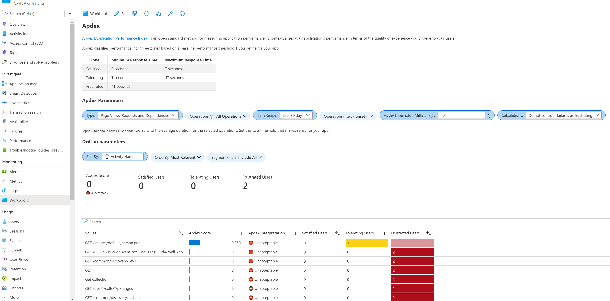
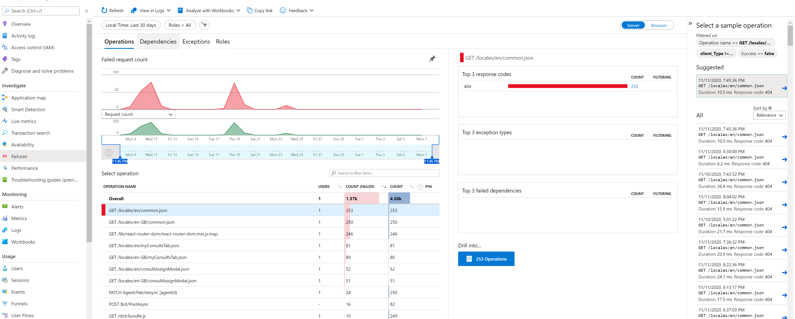

# Telemetry

## Overview
Appointment Manager application logs telemetry to Azure Application Insights. You can go to the Application Insights blade of the Azure App Service to view basic telemetry about the services, such as requests, failures, and dependency errors.

The Teams Bot integrates with Application Insights to gather bot activity analytics.

The app logs a few kinds of events:

<code>Trace</code> logs keeps the track of application events.

<code>Exceptions</code> logs keeps the records of exceptions tracked in the application.

This section shows what is being logged by Application Insights and some of the available charts and log metrices available by default. Change this to suit the needs of your organization. 

# Accesing Application Insights
Application Insights created during the deployment can be found in the created Resource Group.

The following built-in visualization gives you a representation on what is logged over time.

**Investivate** - Gives an insight on failures and detailed logs. This section will help you pin point what went wrong in the application. The report cans how trends as well.

**Monitoring** - Gives an insight on Logs and Metrices. This include request calls, errors, result. You may configure this to visualize a custom time range.

**Usage** - Gives an insight on Users, Sessions, Events, User Flow etc. You may configure this to visualize a custom time range.

**Workbooks** - Workbooks can show a much thorough report. There are a couple of example reports in given in template. You may edit the workbook to show custom reports as well.

**Live metrics** - When the application is running, this shows the live streamed metrics. Metrices include requests, errors, server health etc.

**Troubleshooting Guides(Preview)** - This shows a report overtime on failed requests and it's trend. You may edit this in markdown to provide steps on resolving certain error.

**Failures** - In the Investigate section, this shows the failure over a time range. You may drill down to individual log to investigate the problem. 

